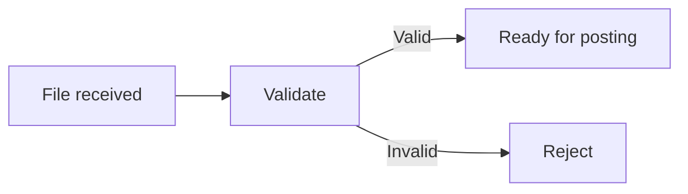
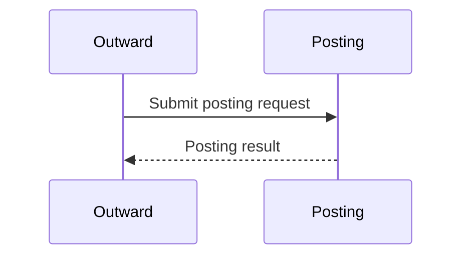
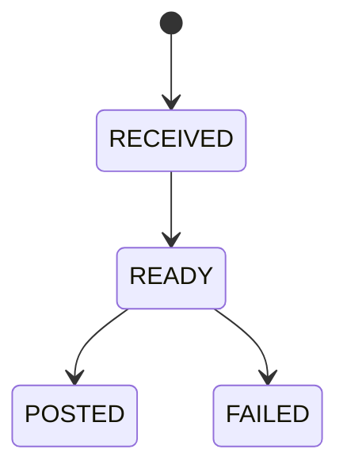

# Mermaid Diagram Guide

## Rule
Use Mermaid for actual diagrams. Never use ASCII boxes/arrows/trees/timelines.

## Required visual coverage
When evidence is sufficient:
- every module overview: end-to-end Mermaid journey
- every significant flow: flowchart or sequence diagram
- meaningful status lifecycle: `stateDiagram-v2`
- multi-component architecture: architecture/flow diagram

If evidence is insufficient to draw a truthful diagram, treat that as a discovery gap. Do not invent a diagram or silently omit it.

## One question per diagram
A diagram should answer one clear question.

Good:
- “How does an outward cheque move from ingestion to submission?”
- “Which states can a record enter during posting?”
- “Which components participate in the submission handoff?”

Avoid giant diagrams that combine module architecture, every class, every status, every DB table, and all exceptions. Split them into overview plus drill-down diagrams.

## Flowcharts
Use for business/process progression and branching.

## Sequence diagrams
Use when call/handoff order between components matters.

## State diagrams
Use when status progression itself is important.

## Labels
Prefer business-readable labels. Add implementation names only when they materially help a developer locate code.
